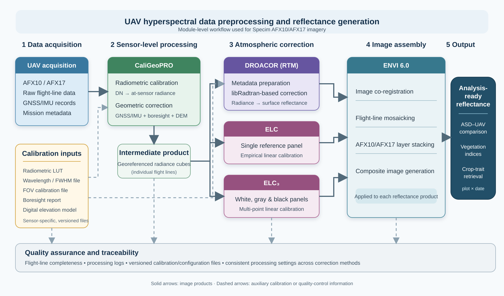

# Atmospheric Correction Uncertainty Propagation in UAV Hyperspectral Data

Code and processed datasets for evaluating how differences introduced by atmospheric correction propagate through UAV hyperspectral reflectance, vegetation indices (VIs), and crop-trait estimation.

This repository accompanies the associated research article and provides the analysis workflow and processed data required to reproduce the main analyses reported in the manuscript.




## Software environment

| Software | Version | Main purpose |
| --- | ---: | --- |
| CaliGeoPRO | 2.2 | Radiometric calibration and geometric correction of the raw AFX flight-line data |
| DROACOR | 2.1 | Radiative-transfer-model-based atmospheric correction |
| ENVI | 6.0 | Image co-registration, flight-line mosaicking, layer stacking, and composite image generation |


Module-level workflow for preprocessing Specim AFX10 and AFX17 UAV hyperspectral imagery and generating analysis-ready surface reflectance. Raw flight-line data and associated GNSS/IMU records were first radiometrically calibrated and geometrically corrected in CaliGeoPRO using sensor-specific calibration files, a boresight calibration report, and a digital elevation model. The resulting georeferenced at-sensor radiance cubes were independently converted to surface reflectance using DROACOR, single-panel empirical line calibration (ELC), and three-panel empirical line calibration (ELC₃). Identical spectral and spatial quality-control procedures were subsequently applied to all three reflectance products before plot-level spectral extraction. Solid arrows represent image products, whereas dashed arrows represent auxiliary calibration or quality-control information.

## Overview

UAV hyperspectral imagery requires atmospheric correction before quantitative analysis. Although different atmospheric correction approaches may produce relatively small differences in surface reflectance, these differences can propagate into downstream products such as vegetation indices and crop-trait estimates.

This repository provides the workflow used to evaluate this propagation chain:

**Atmospheric correction → Surface reflectance → Vegetation indices → Crop-trait estimation**

Three atmospheric correction approaches are compared:

* **RTM** – radiative-transfer-model-based atmospheric correction
* **ELC** – empirical line correction using a single reference panel
* **ELC3** – empirical line correction using three reference panels

Field spectrometer measurements (ASD) are used as reference spectra for evaluating the corrected UAV hyperspectral reflectance.

## Repository Contents

The repository contains the processed datasets and analysis scripts required for three main components of the study.

### 1. Reflectance-level evaluation

Evaluates differences between atmospherically corrected UAV reflectance and field-measured ASD reference spectra.

Main analyses include:

* ASD–UAV spectral matching using the UAV spectral response functions
* Root Mean Square Error (**RMSE**)
* Spectral Angle Mapper (**SAM**)
* Comparison among RTM, ELC, and ELC3 correction products

### 2. Vegetation-index uncertainty analysis

Evaluates how differences among atmospheric correction methods propagate from surface reflectance to vegetation indices.

The workflow includes:

* calculation of vegetation indices from each corrected reflectance product
* comparison of VI differences among atmospheric correction approaches
* error propagation analysis
* linear mixed-effects modelling

### 3. Crop-trait retrieval

Evaluates whether atmospheric-correction-related spectral differences influence downstream crop-trait estimation.

The workflow includes:

* Random Forest regression
* cross-validation and model evaluation
* comparison of retrieval performance among atmospheric correction products
* wavelength-importance analysis

The evaluated crop traits include leaf area index (**LAI**), leaf nitrogen concentration (**LNC**), leaf mass per area (**LMA**), and canopy nitrogen content (**CNC**).

## Data

The repository provides the processed data required to reproduce the analyses presented in the manuscript, including:

* processed UAV hyperspectral reflectance derived using RTM, ELC, and ELC3
* ASD field spectrometer reflectance
* UAV wavelength information
* UAV spectral response functions used for ASD–UAV spectral matching
* vegetation-index and crop-trait data required by the analysis scripts

A limited amount of commercially sensitive information has been removed or anonymized in accordance with project data-management requirements. These modifications do not affect the variables required for the analyses or the reproduction of the results reported in the manuscript.

Raw UAV hyperspectral imagery is not required to run the analyses provided in this repository.

## Requirements

The analyses were implemented in Python.

The main Python packages used include:

* `numpy`
* `pandas`
* `scipy`
* `scikit-learn`
* `statsmodels`
* `matplotlib`

Please refer to `requirements.txt` for the complete package requirements and recommended versions.

## Usage

Clone the repository and install the required Python packages:

```bash
git clone <repository-url>
cd <repository-name>
pip install -r requirements.txt
```

The analysis scripts are organized according to the three stages of the uncertainty-propagation workflow. Each script reads the corresponding processed input files from the data directory and generates the statistical results and/or figures used for the analyses.

Detailed descriptions of the required input files, variables, and outputs are provided with the corresponding scripts.

## Reproducibility

The scripts have been organized to avoid project-specific absolute file paths and use documented input files and reproducible parameter settings.

The shared workflow is intended to reproduce the principal analyses of atmospheric-correction uncertainty propagation reported in the associated manuscript rather than to reproduce the upstream generation of atmospherically corrected hyperspectral imagery from raw UAV data.

## Citation

If you use the code or data from this repository, please cite the associated publication:

> [Citation information will be added upon publication.]

## License

Please refer to the `LICENSE` file for the terms governing reuse of the code and data.

## Contact

For questions regarding the code, data, or analysis workflow, please contact the corresponding author of the associated publication.
